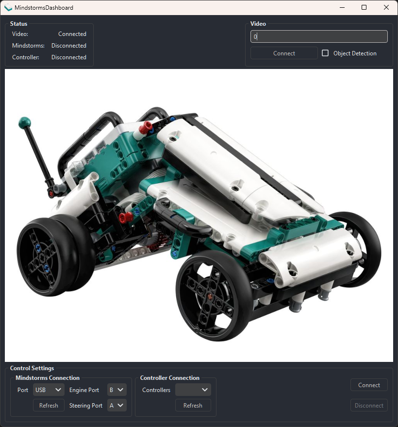

# MindstormsDashboard

This project contains a desktop dashboard for connecting with the M.V.P car bot from the Lego Mindstorms Spike Prime collection. It allows the user to control the bot using controller inputs, and see the bot's view from their phone camera.

In short, it contains the following:

* [PySide6](https://wiki.qt.io/Qt_for_Python) based GUI application.
* Connection to Spike Prime hub with USB or Bluetooth serial connections using the [mindstorms](https://github.com/noamraph/mindstorms) package. This allows the program to execute commands on the hub using the MicroPython REPL.
* Connection to gamepads using the [pygame](https://github.com/pygame/pygame) library to manually drive the bot.
* Live videostream from webcam or phone camera using [OpenCV](https://opencv.org/).
* [YOLOv5](https://github.com/ultralytics/yolov5) based object detection from the camera view.



## Installation

Clone the repository and install the dependencies.

```bash
git clone ...
pip install -r requirements.txt
```

## Usage

To run the dashboard, execute the `run.py` script:

```bash
python run.py
```

## Hub Connection

The dasboard can currently connect to Lego car bots using a two motor configuration. Here, one motor is used as the car's engine, and the other to steer the front wheels.

### Serial Port

The dasboard can be used to connect to the Spike Prime hub using its serial connection. This can be established using a USB cable or using Bluetooth. The program can autodiscover hubs connected by USB when the `USB` port is selected. For Bluetooth connections, the specific COM port needs to be selected from the dropdown menu.

### Engine Ports

The engine ports can be selected using the dropdown menu's. The characters `A` to `F` represent the hub's connection ports. When using the default M.V.P. build, the engine and steer motors should be connected to ports `B` and `A` respectively.

## Controller connection

Gamepads can be connected using the PyGame package. Connect your controller and select it from the dropdown menu. The available controls are as follows:

| Control    | Button            |
|------------|-------------------|
| Forward    | Right-Trigger     |
| Backward   | Left-Trigger      |
| Left/Right | Left-Stick X-axis |
| Beep       | A                 |

## Video Stream

### Phone Camera
A video stream is established using OpenCV. By default, the application attempts to connect to a connected webcam. You can use this option to connect to, for example, your phone camera which is mounted to the bot. To do this, follow these steps:

* Download an IP camera app like [this one](https://play.google.com/store/apps/details?id=com.pas.webcam) and install it on your mobile device.
* Follow the app's instruction to start the server to stream the camera feed
* Note the server's IP address and fill this into the dashboard's `video` field:
    ```
    http://111.111.1.111:8080/video
    ```
* Press `connect` to start the new video stream

### Object Detection

The YOLOv5 object detection model can be used to detect objects from the video feed. To enable this, check the `Object Detection` checkbox. This will use the YOLOv5s COCO model to detect 80 object classes.

## Ideas

* [ ] Sensor panel to monitor the bot's sensors
* [ ] Autonomous mode: Use bot sensors + video stream to avoid obstacles